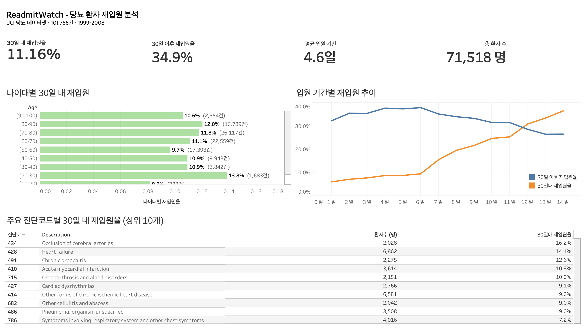

# 🏥 ReadmitWatch — Azure 기반 당뇨 환자 재입원 분석 파이프라인


---

## 📌 프로젝트 개요

미국 당뇨 환자 데이터(UCI, 1999–2008)를 기반으로 재입원 패턴을 분석하는 **Azure 기반 엔드투엔드 데이터 엔지니어링 파이프라인**입니다.

Medicare/Medicaid 정책상 **30일 내 재입원은 병원에 페널티**가 부과됩니다. 이 프로젝트는 재입원 고위험 환자군을 식별하고, 약물 부작용 데이터를 실시간으로 수집해 임상 의사결정을 지원하는 것을 목적으로 합니다.

---

## 아키텍처

### 흐름 1 — 환자 데이터 수집 (배치)

```
로컬 CSV
    └─▶ Python 전처리 (notebooks/preprocess.ipynb)
            └─▶ Azure Blob Storage (raw/)
                    └─▶ ADF Copy 파이프라인 (pl_rmw_ingest)
                                └─▶ Azure SQL Database
```

### 흐름 2 — FDA 부작용 데이터 수집 (실시간)

```
OpenFDA API
    └─▶ Azure Functions (타이머 트리거, 매 시간)
                └─▶ Blob Storage (raw/fda_adverse_events.csv)
                            └─▶ ADF Blob 이벤트 트리거 (tr_blob_fda)
                                        └─▶ ADF Data Flow (df_fda_transform)
                                                    └─▶ Azure SQL Database
```

### 흐름 3 — 모니터링 & 배포

```
ADF 파이프라인 실패
    └─▶ Logic Apps ──▶ Microsoft Teams 알림

functions/ 코드 변경 (push to main)
    └─▶ GitHub Actions ──▶ Azure Functions 자동 배포
```

---

## 📊 대시보드



---

## 기술 스택

**Cloud**  


**IaC / Language / Visualization / CI/CD**  


---

## 📂 데이터

| 출처 | 설명 | 규모 |
|------|------|------|
| [Kaggle — Diabetes 130-US hospitals](https://www.kaggle.com/datasets/brandao/diabetes) | 미국 130개 병원 당뇨 입원 기록 (1999–2008) | 101,766건, 50컬럼 |
| OpenFDA Drug Event API | 당뇨 관련 약물 부작용 보고 데이터 | 매시간 자동 수집 |

---

## 🗄️ DB 테이블 구조

```
patients           — patient_nbr, race, gender, age                    (71,518명)
admissions         — encounter_id, patient_nbr, admission_type_id,
                     time_in_hospital, readmitted
medications        — encounter_id, insulin, metformin 등
diagnoses          — encounter_id, diag_1, diag_2, diag_3
icd9_mapping       — code, description                                  (ICD-9 코드 매핑)
fda_adverse_events — drug, reaction, count
```

---

## 📈 주요 분석 결과

| 지표 | 수치 |
|------|------|
| 30일 내 재입원율 | **11.16%** |
| 30일 이후 재입원율 | **34.9%** |
| 고위험 진단 | 뇌졸중(ICD-9: 434) **16.2%**, 심부전(428) **14.1%** |
| 고위험 연령대 | 80–90세 **12.0%** |

---

## ▶️ 실행 방법

### 사전 요구사항

- Azure CLI 로그인 완료
- Terraform >= 1.0
- Python 3.11
- Azure Functions Core Tools v4

### 1. 인프라 생성

```bash
cd terraform
cp terraform.tfvars.example terraform.tfvars
# terraform.tfvars에 subscription_id, sql_password 입력 후 실행
terraform init
terraform apply
```

### 2. 데이터 전처리 및 업로드

```bash
# Jupyter에서 notebooks/preprocess.ipynb 실행 후
az storage blob upload-batch \
  --source data \
  --destination raw \
  --account-name <YOUR_STORAGE_ACCOUNT>
```

### 3. Functions 로컬 테스트

```bash
cd functions
# local.settings.json에 STORAGE_CONNECTION_STRING 입력
func start
```

### 4. Azure 배포

```bash
func azure functionapp publish func-rmw
```

> **GitHub Actions 자동 배포**: `functions/` 하위 파일 변경 후 `main` 브랜치에 push하면 자동으로 배포됩니다.  
> GitHub Secrets에 `AZURE_FUNCTIONAPP_PUBLISH_PROFILE` 등록이 필요합니다.

---

## 🔐 환경 변수 설정

| 파일 | 변수 | 설명 |
|------|------|------|
| `terraform/terraform.tfvars` | `subscription_id` | Azure 구독 ID |
| `terraform/terraform.tfvars` | `sql_password` | SQL Server 관리자 비밀번호 |
| `functions/local.settings.json` | `STORAGE_CONNECTION_STRING` | Blob Storage 연결 문자열 |

> `terraform.tfvars`와 `local.settings.json`은 `.gitignore`에 포함되어 있어 커밋되지 않습니다.

---

## 📁 프로젝트 구조

```
readmitwatch/
├── .github/
│   └── workflows/
│       └── deploy_functions.yml   # Functions CI/CD
├── adf/
│   ├── adf_pipeline.json          # FDA 변환 파이프라인 (pl_fda)
│   ├── adf_dataflow.json          # FDA Data Flow (df_fda_transform)
│   ├── adf_rmw_ingest.json        # 환자 데이터 수집 파이프라인 (pl_rmw_ingest)
│   ├── adf_trigger_blob_fda.json  # Blob 이벤트 트리거 (tr_blob_fda)
│   └── logicapp_alert.json        # Teams 알림 Logic App
├── functions/
│   ├── function_app.py            # OpenFDA 수집 함수 (타이머 트리거)
│   ├── host.json
│   └── requirements.txt
├── notebooks/
│   ├── preprocess.ipynb           # 데이터 전처리 및 Blob 업로드
│   └── brfss.ipynb                # BRFSS 탐색적 분석
├── terraform/
│   ├── main.tf                    # Azure 리소스 정의
│   └── variables.tf               # 변수 선언
├── data/                          # 원본 CSV (gitignore)
├── Dashboard.png                  # Tableau 대시보드 스크린샷
└── .gitignore
```
